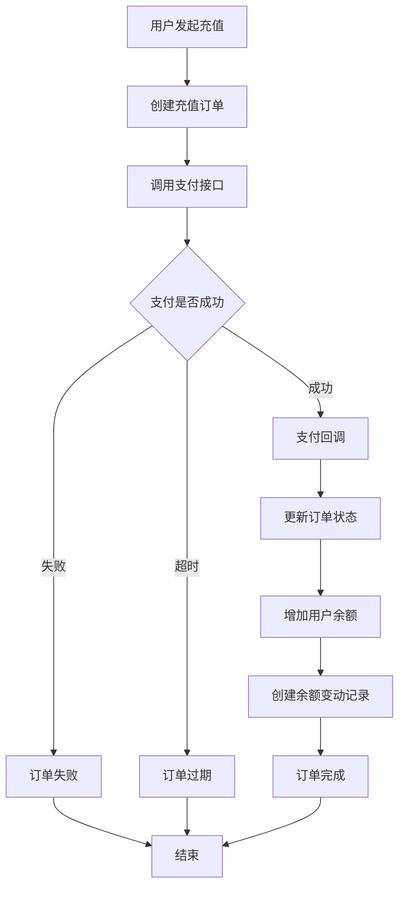

# UniShop 余额充值功能设计文档

## 概述

本文档描述了 UniShop 系统中用户余额充值功能的设计与实现，包括充值订单管理、余额变动记录、API 接口等完整功能。

## 数据库设计

### 1. 充值订单表 (recharge_orders)

用于存储用户的充值订单信息，支持完整的充值订单生命周期管理。

**表结构：**
```sql
CREATE TABLE `recharge_orders` (
    `id` bigint(20) UNSIGNED NOT NULL AUTO_INCREMENT,
    `order_sn` varchar(150) NOT NULL COMMENT '充值订单号',
    `user_id` bigint(20) NOT NULL COMMENT '用户ID',
    `amount` decimal(10,2) NOT NULL COMMENT '充值金额',
    `actual_amount` decimal(10,2) DEFAULT 0.00 COMMENT '实际到账金额',
    `bonus_amount` decimal(10,2) DEFAULT 0.00 COMMENT '赠送金额',
    `payment_method` varchar(50) NOT NULL COMMENT '支付方式',
    `pay_id` int(11) DEFAULT NULL COMMENT '支付通道ID',
    `trade_no` varchar(200) DEFAULT '' COMMENT '第三方支付订单号',
    `buy_ip` varchar(50) NOT NULL COMMENT '充值IP地址',
    `status` tinyint(4) DEFAULT 1 COMMENT '状态:1-待支付,2-已支付,3-已完成,4-已失败,5-已取消,-1-已过期',
    `remark` text COMMENT '备注',
    `payment_data` json COMMENT '支付相关数据',
    `paid_at` timestamp NULL COMMENT '支付时间',
    `completed_at` timestamp NULL COMMENT '完成时间',
    `expired_at` timestamp NULL COMMENT '过期时间',
    `created_at` timestamp NULL DEFAULT NULL,
    `updated_at` timestamp NULL DEFAULT NULL,
    `deleted_at` timestamp NULL DEFAULT NULL,
    PRIMARY KEY (`id`),
    UNIQUE KEY `order_sn` (`order_sn`),
    KEY `idx_user_id` (`user_id`),
    KEY `idx_status` (`status`),
    KEY `idx_payment_method` (`payment_method`)
);
```

**状态说明：**
- 1: 待支付 - 订单已创建，等待用户支付
- 2: 已支付 - 用户已完成支付，等待系统处理
- 3: 已完成 - 充值已到账，流程完成
- 4: 已失败 - 支付失败或处理失败
- 5: 已取消 - 用户取消订单
- -1: 已过期 - 订单超时未支付

### 2. 余额变动表 (balance_logs)

用于记录用户余额的所有变动历史，提供完整的资金流水记录。

**表结构：**
```sql
CREATE TABLE `balance_logs` (
    `id` bigint(20) UNSIGNED NOT NULL AUTO_INCREMENT,
    `log_sn` varchar(150) NOT NULL COMMENT '变动流水号',
    `user_id` bigint(20) NOT NULL COMMENT '用户ID',
    `type` tinyint(4) NOT NULL COMMENT '变动类型:1-充值,2-消费,3-退款,4-奖励,5-扣除,6-转账转入,7-转账转出',
    `amount` decimal(10,2) NOT NULL COMMENT '变动金额(正数为增加，负数为减少)',
    `balance_before` decimal(10,2) NOT NULL COMMENT '变动前余额',
    `balance_after` decimal(10,2) NOT NULL COMMENT '变动后余额',
    `source_type` varchar(100) COMMENT '来源类型:recharge_order,order,refund,reward,manual',
    `source_id` bigint(20) COMMENT '来源ID',
    `title` varchar(200) NOT NULL COMMENT '变动标题',
    `description` text COMMENT '变动描述',
    `admin_user` varchar(100) COMMENT '操作管理员(手动操作时)',
    `extra_data` json COMMENT '扩展数据',
    `created_at` timestamp NULL DEFAULT NULL,
    `updated_at` timestamp NULL DEFAULT NULL,
    PRIMARY KEY (`id`),
    UNIQUE KEY `log_sn` (`log_sn`),
    KEY `idx_user_id` (`user_id`),
    KEY `idx_type` (`type`),
    KEY `idx_source_type_id` (`source_type`, `source_id`)
);
```

**变动类型说明：**
- 1: 充值 - 用户充值增加余额
- 2: 消费 - 用户购买商品等消费行为
- 3: 退款 - 订单退款返还余额
- 4: 奖励 - 系统奖励、推荐返利等
- 5: 扣除 - 违规扣除、手动扣款等
- 6: 转账转入 - 接收其他用户转账
- 7: 转账转出 - 向其他用户转账

## 核心业务逻辑

### 1. 余额管理服务 (BalanceService)

**主要功能：**
- 创建充值订单
- 处理充值成功回调
- 增加/减少用户余额
- 创建余额变动记录
- 查询余额和变动历史

**核心特性：**
- 数据库事务保证一致性
- 用户记录行锁防止并发问题
- 自动生成订单号和流水号
- 余额不足检查
- 完整的审计日志

### 2. 充值流程设计



## API 接口设计

### 1. 获取用户余额
- **URL:** `GET /api/v1/user/balance`
- **认证:** Bearer Token
- **响应:** 用户当前余额信息

### 2. 创建充值订单
- **URL:** `POST /api/v1/user/balance/recharge`
- **认证:** Bearer Token
- **参数:**
  - `amount`: 充值金额 (必填)
  - `payment_method`: 支付方式 (必填)
- **响应:** 充值订单信息

### 3. 获取充值订单列表
- **URL:** `GET /api/v1/user/balance/recharge-orders`
- **认证:** Bearer Token
- **参数:**
  - `page`: 页码 (可选)
  - `page_size`: 每页数量 (可选)
  - `status`: 订单状态 (可选)
- **响应:** 分页的充值订单列表

### 4. 获取余额变动记录
- **URL:** `GET /api/v1/user/balance/logs`
- **认证:** Bearer Token
- **参数:**
  - `page`: 页码 (可选)
  - `page_size`: 每页数量 (可选)
  - `type`: 变动类型 (可选)
- **响应:** 分页的余额变动记录

## 文件结构

```
app/
├── Models/
│   ├── RechargeOrder.php          # 充值订单模型
│   └── BalanceLog.php             # 余额变动记录模型
├── Services/
│   └── BalanceService.php         # 余额管理服务
└── Http/Controllers/ApiV1/User/
    └── BalanceController.php      # 余额相关API控制器

database/migrations/
├── 2025_09_17_170511_create_recharge_orders_table.php
└── 2025_09_17_170512_create_balance_logs_table.php

routes/common/apiv1/
└── balance.php                    # 余额相关路由
```

## 安全考虑

### 1. 数据一致性
- 使用数据库事务确保操作原子性
- 行级锁防止并发操作导致的数据不一致
- 余额变动前后的完整性检查

### 2. 访问控制
- 所有接口都需要用户认证
- 用户只能操作自己的余额和订单
- 敏感操作记录操作日志

### 3. 参数验证
- 充值金额范围限制
- 支付方式白名单验证
- 分页参数合理性检查

## 扩展性设计

### 1. 支付方式扩展
- 支持多种支付渠道 (支付宝、微信、银行卡等)
- 支付通道配置化管理
- 支付回调统一处理

### 2. 营销活动支持
- 充值赠送金额计算
- 优惠券抵扣
- 会员等级充值折扣

### 3. 财务对账
- 完整的资金流水记录
- 支持财务报表生成
- 第三方支付对账功能

## 使用示例

### 1. 创建充值订单
```bash
curl -X POST "http://your-domain/api/v1/user/balance/recharge" \
     -H "Authorization: Bearer YOUR_TOKEN" \
     -H "Content-Type: application/json" \
     -d '{
       "amount": 100.00,
       "payment_method": "alipay"
     }'
```

### 2. 查询余额
```bash
curl -X GET "http://your-domain/api/v1/user/balance" \
     -H "Authorization: Bearer YOUR_TOKEN"
```

### 3. 查询余额变动记录
```bash
curl -X GET "http://your-domain/api/v1/user/balance/logs?page=1&page_size=20" \
     -H "Authorization: Bearer YOUR_TOKEN"
```

## 部署说明

### 1. 数据库迁移
```bash
php artisan migrate
```

### 2. 路由注册
在 `routes/api.php` 中引入余额相关路由：
```php
Route::prefix('user')->group(base_path('routes/common/apiv1/balance.php'));
```

### 3. 服务注册
在 `AppServiceProvider` 中注册 `BalanceService`：
```php
$this->app->singleton(BalanceService::class);
```

## 总结

本余额充值功能设计完整覆盖了用户充值的全流程，包括：
- 完善的数据库设计，支持复杂的业务场景
- 安全可靠的余额管理服务
- 完整的 API 接口，支持前端各种业务需求
- 良好的扩展性，便于后续功能增加

该设计遵循了 Laravel 最佳实践，具有良好的代码结构和可维护性。